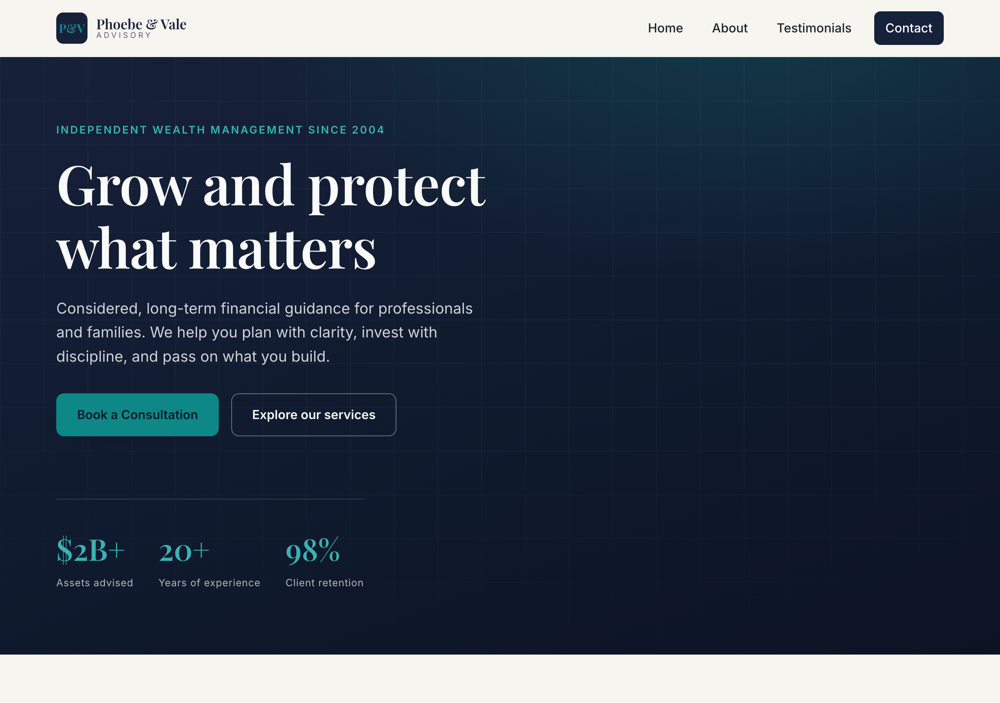

# Phoebe & Vale Advisory

A single-page marketing website for **Phoebe & Vale Advisory**, a long-term wealth management firm. Built as a fast, lightweight static site with plain HTML, CSS, and JavaScript — no build step or framework required.

## 🌐 Live Site

**https://haixinni123.github.io/haixinni/**



## ✨ Features

- Responsive, mobile-friendly landing page
- Sections for Home, About, Services, Clients (testimonials), and Contact
- Distinctive **emerald + champagne-gold on ivory** luxury identity, with a signature
  ascending "compounding" curve and gold scroll-progress hairline
- Smooth in-page navigation, active-section highlighting, animated stat counters,
  and an accessible testimonial carousel
- Lead-capture enquiry form (FormSubmit AJAX) with inline validation and honeypot
- On-page SEO baked in: canonical, Open Graph/Twitter cards, JSON-LD `FinancialService`
  schema, `robots.txt`, and `sitemap.xml`
- Custom typography (Cormorant Garamond + Jost via Google Fonts)
- Accessibility floor: skip link, visible focus, reduced-motion support
- Zero dependencies — pure HTML/CSS/JS

## 📁 Project Structure

```
.
├── index.html      # Page markup, content, and SEO meta / JSON-LD
├── styles.css      # All styling (design tokens in :root)
├── script.js       # Interactive behavior (nav, reveals, carousel, form)
├── robots.txt      # Crawler directives
├── sitemap.xml     # XML sitemap
├── assets/
│   └── screenshot.png   # Social preview (Open Graph) image
└── .github/
    └── workflows/
        └── deploy.yml   # Auto-deploys to GitHub Pages on push to main
```

## 🚀 Local Development

No tooling needed. Either open the file directly:

```bash
open index.html
```

…or serve it locally (recommended, so paths resolve correctly):

```bash
python3 -m http.server 8000
# then visit http://localhost:8000
```

## 📦 Deployment

Deployment is fully automated via **GitHub Actions**. Every push to the `main`
branch triggers the [deploy workflow](.github/workflows/deploy.yml), which
publishes the site to GitHub Pages. No manual steps required.

```bash
git add .
git commit -m "Update site"
git push origin main   # site redeploys automatically
```

## 📄 License

All rights reserved.
